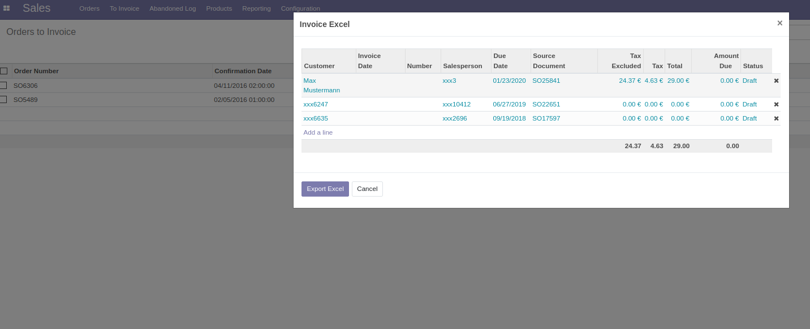

===============
Invoice Export
===============

**Table of contents**

.. contents::
   :local:

Description
===========

The custom module invoice_export allows to export sales information to a spread sheet.

Usage
=====

Go to Sales -> Orders -> Invoice Excel

In the field that opens select "Add a line" and enter e.g. "Gentoo". Select the month by activating the corresponding checkbox and finish the process with "Export Excel".

Credits
=======

Authors
~~~~~~~

* Nitrokey GmbH
